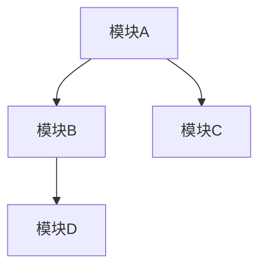

# 软件实现设计说明书 (SDD) 模板

> **使用指南**
> - 使用简洁、明确的语言
> - 重点关注模块间的依赖关系和约束
> - 记录重要的架构决策及其理由
> - 保持文档与代码同步更新

---

## 文档元数据
```yaml
document:
  type: "软件实现设计说明书模板"
  project: "{{项目名称}}"
  desc: "{{项目简介}}"

【可选】appendix_ref:
  detailed_modules: "软件实现设计说明书-附录A-详细模块定义"
  adr_records: "软件实现设计说明书-附录B-架构决策记录"
```

> **说明：** 文档元数据用于快速识别文档的基本信息。`appendix_ref` 可选字段用于引用更详细的附录文档，当主文档过于冗长时，可将详细内容拆分到附录中。

---

# 目录

> **说明：** 目录采用JSON格式，便于工具解析和自动化处理。`range` 字段表示章节的行号范围，当文档内容更新时需要同步更新这些值。

```json
{
  "document": {
    "file": "软件实现设计说明书模板.md",
    "totalLines": 237,
    "structure": [
      {
        "section": "文档元数据",
        "range": [1, 15]
      },
      {
        "section": "系统概览",
        "range": [86, 126],
        "subsections": [
          {"name": "系统定位", "range": [88, 98]},
          {"name": "系统边界", "range": [100, 111]},
          {"name": "上下游关系", "range": [113, 125]}
        ]
      },
      {
        "section": "模块清单",
        "range": [129, 171],
        "subsections": [
          {"name": "模块概览", "range": [131, 142]},
          {"name": "模块职责表", "range": [144, 152]},
          {"name": "模块依赖关系", "range": [154, 171]}
        ]
      },
      {
        "section": "架构原则",
        "range": [174, 208],
        "subsections": [
          {"name": "核心设计原则", "range": [176, 194]},
          {"name": "反模式禁令", "range": [196, 207]}
        ]
      },
      {
        "section": "架构决策摘要",
        "range": [212, 221],
        "subsections": [
          {"name": "近期重要决策", "range": [214, 221]}
        ]
      },
      {
        "section": "术语解释",
        "range": [223, 223]
      },
      {
        "section": "附录索引",
        "range": [225, 237],
        "appendices": [
          {"name": "A-详细模块定义"},
          {"name": "B-架构决策记录"}
        ]
      }
    ]
  }
}
```

## 1 系统概览

> **说明：** 系统概览部分帮助AI Agent快速理解系统的定位、边界和外部依赖关系。这些信息对于理解代码变更的影响范围至关重要。

### 1.1 系统定位

```markdown
**系统名称**: {{系统名称}}

**一句话描述**: {{用一句话说明这个系统是做什么的}}

**所属领域**: {{业务领域}}

**核心价值**: {{提供3个核心价值点}}
```

> **说明：** 明确系统的边界有助于AI Agent判断某个功能是否应该在本系统中实现，避免职责不清导致的代码混乱。


### 1.2 系统边界

```yaml
boundaries:
  includes:
    - "{{包含的功能范围1}}"
    - "{{包含的功能范围2}}"

  excludes:
    - "{{明确排除的内容1}}"
    - "{{明确排除的内容2}}"
```

> **说明：** 上下游关系描述了系统与外部系统的交互方式。AI Agent在修改接口或数据结构时，需要考虑对上下游系统的影响。

### 1.3 上下游关系

```yaml
upstream:
  - system: "{{上游系统}}"
    integration: "{{集成方式}}"
    purpose: "{{用途}}"

downstream:
  - system: "{{下游系统}}"
    integration: "{{集成方式}}"
    purpose: "{{用途}}"
```
---

## 2 模块清单

> **说明：** 模块清单是SDD的核心内容，它定义了系统的模块划分、职责和依赖关系。AI Agent通过这部分信息可以：
> - 理解代码的组织结构
> - 判断新功能应该放在哪个模块
> - 避免违反模块依赖规则
> - 理解模块间的协作关系
> - 当一个目录下代码文件超过10个，理应作为一个独立模块看待，并于模块概览中单独列举
> 

> **说明：** 模块职责表以表格形式汇总所有模块的核心职责，便于快速查阅。`category` 字段帮助区分业务模块、技术模块和共享模块。

### 2.1 模块职责表

| 模块名      | 职责                        | 类别         |相对路径|
|-------------|-----------------------------|--------------|-------|
| {{ModuleA}} | {{核心职责：xxx、xxx、xxx}} | {{业务}}     |{{当前代码仓下相对路径}}|
| {{ModuleB}} | {{核心职责：xxx、xxx、xxx}} | {{基础能力}} |{{当前代码仓下相对路径}}|
| {{ModuleC}} | {{核心职责：xxx、xxx、xxx}} | {{工具}}     |{{当前代码仓下相对路径}}|

> → 附录A: 详细模块定义

> **说明：** Mermaid图直观展示模块间的依赖关系，`dependency_rules` 定义了依赖约束规则。AI Agent在生成代码时必须遵守这些规则，否则会导致架构腐化。

### 2.2 模块依赖关系



```yaml
dependency_rules:
  - rule: "{{规则1，如: 业务模块不能互相依赖}}"
    rationale: "{{理由}}"

  - rule: "{{规则2}}"
    rationale: "{{理由}}"
```

---

## 3 架构原则

> **说明：** 架构原则是系统设计的指导方针，AI Agent在生成代码时应该遵循这些原则。`priority` 字段表示原则的重要性（P0最高）。

### 3.1 核心设计原则

```yaml
design_principles:
  - principle: "{{原则1，如: 模块独立}}"
    priority: "P0"
    description: "{{一句话描述}}"
    application: "{{如何应用}}"

  - principle: "{{原则2，如: 接口隔离}}"
    priority: "P1"
    description: "{{一句话描述}}"
    application: "{{如何应用}}"

  - principle: "{{原则3}}"
    priority: "P1"
    description: "{{一句话描述}}"
    application: "{{如何应用}}"
```

> **说明：** 反模式禁令明确列出禁止使用的代码模式，AI Agent必须避免这些模式。`alternative` 字段提供了正确的替代方案。

### 3.2 反模式禁令

```yaml
anti_patterns:
  - pattern: "{{反模式1}}"
    reason: "{{为什么禁止}}"
    alternative: "{{应该怎么做}}"

  - pattern: "{{反模式2}}"
    reason: "{{为什么禁止}}"
    alternative: "{{应该怎么做}}"
```

---

## 4 术语解释

> **说明：** 术语解释部分用于定义文档中使用的专业术语或项目特有的概念，帮助读者理解文档内容。